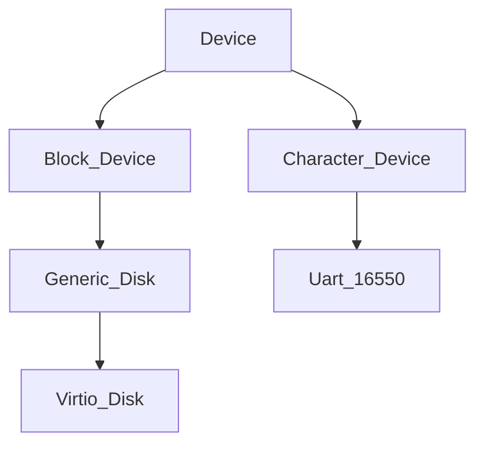

# Devices

There are two types of devices: character devices and block devices: 
- **Block devices** allow random access and read/write blocks of data, e.g. hard drives. 
- **Character devices** are stream devices like a UART connection or keyboard input and read/write one byte/char at a time.

The major device number defines the driver to use, the minor number can select sub devices (e.g. partitions of a disk or multiple physical UARTs handled by the same driver). In practice, minor device numbers are not used yet.

All devices are stored in `g_devices`. Add one with `register_device()`, find devices with `get_block_device(device number)` / `get_character_device(device number)`.

### General

Devices form a class hierarchy (see [[object_orientation]] for details on how this is implemented in C):

Linux has a similar structure (`device`, `block_device`, `gendisk`, `cdev`).

`dev_t`
- encodes major and minor device ID
- together with block number the key for the block cache of block devices

#### Access via File System

Access to a device / driver via [file](../file_system/file.md) operations is the traditional UNIX API. To create a special file which points to a device, use [mknod](../syscalls/mknod.md).

#### Device Interrupts

All devices can have a `dev->irq_number` to get interrupts for that number (`dev->dev_ops.interrupt_handler`). See `handle_plic_device_interrupt()`.

### Block Devices

Block devices are normally disks with [file systems](../file_system/file_system.md). Access to block devices is routed through a block io cache: 
_Filesystem syscall_ -> _file system_ -> _block io cache_ -> _block device_

**List of Block Devices:**
- virtio_disk
- [ramdisk](ramdisk.md)

### Character Devices

Character devices have read / write functions for variable length of strings. 

**List of Character Devices:**
- [console](../../userspace/dev/console.md)
- [null](../../userspace/dev/null.md)
- [zero](../../userspace/dev/zero.md)

---
**Overview:** [kernel](../kernel.md)

**Subsystems:** [interrupts](../interrupts/interrupts.md) | [devices](devices.md) | [file_system](../file_system/file_system.md) | [memory_management](../mm/memory_management.md)
[processes](../processes/processes.md) | [scheduling](../processes/scheduling.md) | [syscalls](../syscalls/syscalls.md)

**Devices:** [ramdisk](ramdisk.md)
